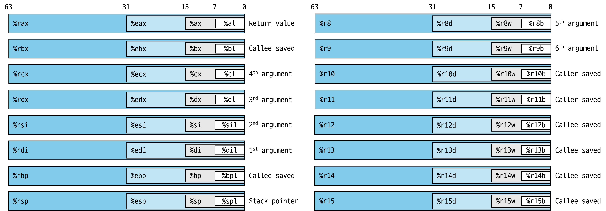

# 레지스터
{: .no_toc }

x86-64 중앙 처리 장치(CPU)는 아래 그림과 같이 64비트 값을 저장하는 **16개**의 **범용 레지스터**들을 포함하고 있다.

이 레지스터들은 정수 데이터와 포인터를 저장하는 데 사용된다.

원래 인텔 8086에는 **%ax**부터 **%bp**까지 8개의 16비트 레지스터가 존재했고 이 레지스터들에게는 구체적인 용도가 있었기 때문에 용도에 맞는 이름이 주어졌다.
> 런타임 스택의 끝 지점을 나타내는 **%rsp**(stack pointer)

이후에 IA32로 확장되면서 크기가 16비트에서 32비트로, x86-64로 확장되면서 32비트에서 **64비트**로 늘어나게 되었고 **%r8 ~ %r15**라는 이름의 8개의 새로운 레지스터들이 추가되었다.

명령어는 레지스터에 저장된 여러가지 크기의 데이터(그림에서 나뉘어진 구역)를 대상으로 실행될 수 있다.
> 바이트 연산 -> 레지스터의 최하위 바이트 
> 16비트 연산 -> 레지스터의 최하위 2바이트 
> 32비트 연산 -> 레지스터의 최하위 4바이트 
> 64비트 연산 -> 레지스터의 전체 바이트
